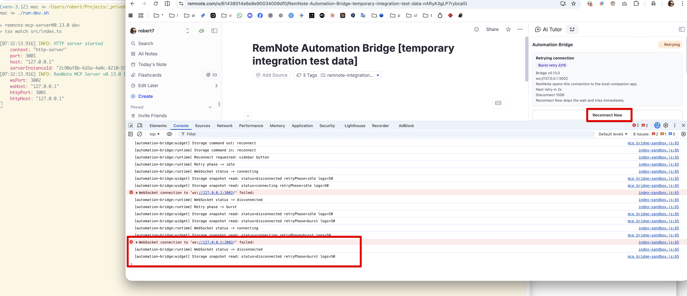
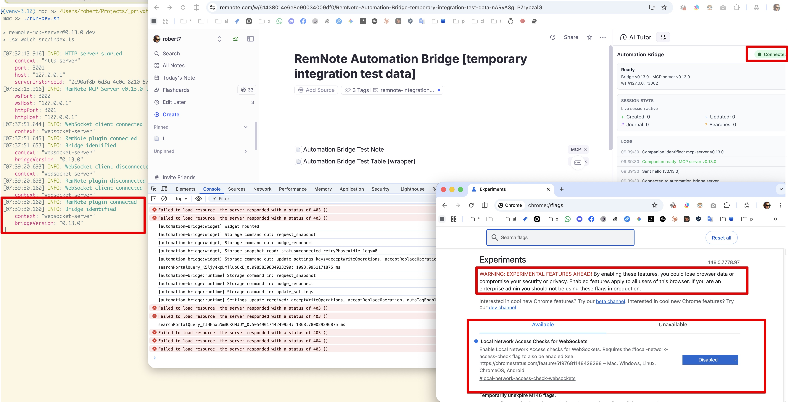

# Connection Lifecycle

This guide explains what the Automation Bridge does after RemNote starts, how reconnect works, and what the sidebar
status means.

## High-Level Flow

1. The plugin activates when RemNote loads.
2. The bridge runtime starts automatically in the background.
3. The bridge tries to connect to the configured WebSocket server URL.
   - Default: `ws://127.0.0.1:3002`
4. Once connected, the bridge is ready for either:
   - MCP clients connected to `remnote-mcp-server`
   - `remnote-cli` commands connected to `remnote-mcp-server`

The right-sidebar Automation Bridge panel is optional. It is now a monitoring and manual-control surface, not the thing
that creates the connection.

## Why The Bridge Connects Outward

The connection direction is:

```text
RemNote UI + Bridge Plugin -> remnote-mcp-server <- MCP clients / remnote-cli commands
```

This can feel backwards at first because many people expect the local server process to connect into RemNote.

The reason is a RemNote platform constraint: RemNote plugins do not have a hosted backend API. RemNote explicitly
recommends frontend-plugin-based approaches instead of relying on a backend plugin API. See the official RemNote docs:
[Backend Plugins](https://plugins.remnote.com/advanced/backend_plugins).

So in this project:

- the bridge plugin is the WebSocket client
- `remnote-mcp-server` is the WebSocket server
- MCP clients and CLI commands talk to `remnote-mcp-server`, not directly to RemNote

That is why startup order matters: the bridge always tries to connect outward from RemNote to the configured local
server process.

## Recommended Startup Order

1. Start the local server process first.
   - `remnote-mcp-server`
2. Open RemNote.
3. Wait for the bridge to connect in the background.
4. Open the sidebar panel only if you want to inspect status, logs, or click **Reconnect Now**.

If RemNote was already open before the local server process started, the bridge should still reconnect automatically. It
may just take a moment depending on which retry phase it is currently in.

## Retry Phases

### Initial Connect

When the plugin starts, the bridge tries to connect immediately.

If that succeeds, the sidebar shows **Connected** and the bridge is ready to accept requests.


Connected state example: the bridge is live, the local server endpoint is shown, and the session card confirms a
healthy active connection.

### Burst Retry

If the local server process is unavailable, the bridge enters a fast retry window:

- Up to 10 retries
- Exponential backoff
- Starts around 1 second
- Grows up to about 30 seconds
- Includes small jitter to avoid retry thundering

The sidebar shows this as **Retrying** and displays both:

- the current burst attempt count
- the next scheduled retry countdown


Burst retry example: the sidebar shows the current retry attempt, the next retry countdown, the last disconnect code,
and the immediate **Reconnect Now** action.

### Standby Retry

After the fast retry window is exhausted, the bridge switches to standby mode:

- retries continue indefinitely
- one background retry roughly every 10 minutes
- small jitter still applies

The sidebar shows this as **Waiting for server** and displays the next background retry countdown.

## What Can Wake It Up Sooner?

Even in standby mode, the bridge can retry sooner than the scheduled timer.

Immediate reconnect can be triggered by:

- clicking **Reconnect Now** in the sidebar
- opening the Automation Bridge panel
- moving focus inside RemNote (for example, changing pane focus, focused note, or focused portal)
- browser/tab visibility returning
- browser `online` event

This means a common workflow works well:

1. Leave RemNote open.
2. Start `remnote-mcp-server` later.
3. Open the Automation Bridge panel or move focus to another note/pane in RemNote.
4. The bridge should immediately restart the faster retry window instead of waiting for the full standby timer.

Important detail: normal in-app activity is a more reliable wake-up trigger than raw browser-window focus in RemNote.
If none of those wake-up signals happen, the bridge reconnects on:

- the next scheduled retry
- a later RemNote activity / visibility / online event
- or manual **Reconnect Now**

## Sidebar Status Meanings

### Connected

The bridge is live and ready for MCP or CLI requests.

### Connecting

The bridge is actively trying to open a WebSocket connection right now.

This can happen on:

- initial startup
- a scheduled retry firing
- a panel-open, RemNote-activity, visibility, or online wake-up
- manual **Reconnect Now**

### Retrying

The fast retry window is active.

The panel shows:

- burst attempt count
- next retry countdown
- last disconnect reason, when available

### Waiting for server

The bridge is in standby mode.

The panel shows:

- next background retry countdown
- last disconnect reason, when available
- a hint that opening the panel or moving focus in RemNote restarts faster retries, while browser visibility/online can
  also wake it sooner

## Practical Scenarios

### RemNote Open First, Server Starts Later

This is supported.

The bridge keeps retrying in the background. If you want to speed it up, either:

- open the Automation Bridge panel
- switch notes or panes inside RemNote
- or click **Reconnect Now**

When the bridge is already in standby, opening the panel or moving focus inside RemNote should restart the faster retry
window instead of doing only one isolated retry attempt.

### RemNote Open on a Browser Machine for a Long Time

This is also supported.

If the local server process appears much later, the bridge eventually reconnects on its own. The sidebar gives you the
best clue about whether it is still in fast retry mode or already in standby.

## If It Still Does Not Connect

Check:

1. `remnote-mcp-server` is actually running.
2. The WebSocket URL in plugin settings matches the server port.
3. Nothing else is occupying the port.
4. The sidebar's last disconnect reason and logs.

Then use **Reconnect Now** once after confirming `remnote-mcp-server` is listening. If that still fails, capture the
sidebar state and logs before restarting anything.

### Chrome Local Network Access Can Block Browser WebSockets

This issue is only relevant when RemNote is running in a Chromium-based browser such as Chrome, Arc, Brave, or Edge.
The RemNote desktop app currently works normally with the local bridge WebSocket.

Chrome/Chromium 147+ can block the bridge WebSocket when RemNote is running in the browser and the marketplace plugin
iframe is loaded from `https://www.remnoteplugins.com`. The bridge connects from that public HTTPS origin to the local
local server WebSocket at `ws://127.0.0.1:3002`, which can trigger Chrome's Local Network Access checks for WebSockets.

Typical symptoms:

- The Automation Bridge sidebar stays **Retrying** or **Waiting for server**.
- DevTools shows `WebSocket connection to 'ws://127.0.0.1:3002/' failed:`.
- `remnote-mcp-server` is listening, but its logs show no incoming WebSocket connection attempt.
- Opening `http://127.0.0.1:3002` or `ws://127.0.0.1:3002` from another browser context may still prove the port is
  reachable, because the failing connection is the plugin iframe connection.



One workaround is to disable Chrome's experimental WebSocket Local Network Access flag:

1. Open `chrome://flags/#local-network-access-check-websockets`.
2. Set **Local Network Access Checks for WebSockets** to **Disabled**.
3. Restart Chrome.
4. Reopen RemNote and use **Reconnect Now** if needed.



This flag is browser-wide and experimental. Chrome warns that changing experimental flags can affect browser security,
privacy, or stored data, so only use this workaround if you understand the tradeoff. See the
[ChromeStatus entry](https://chromestatus.com/feature/5197681148428288) and Chromium's
[Local Network Access checks for WebSockets discussion](https://groups.google.com/a/chromium.org/g/blink-dev/c/4gx2y5jPGbU)
for browser-side details.

For development or source-level testing, you can avoid the marketplace plugin origin by loading the plugin from
`http://localhost:8080/`; see [Run The Plugin Locally](./development-run-plugin-locally.md).
