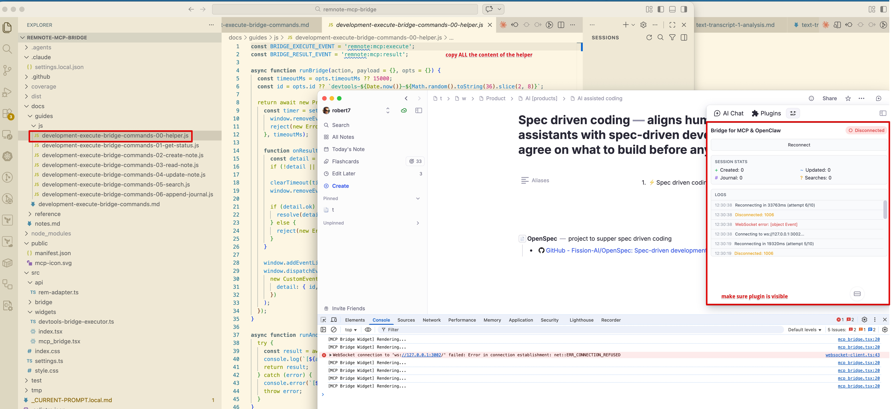
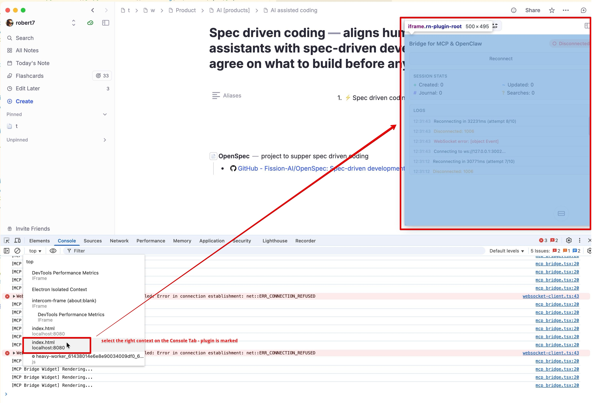
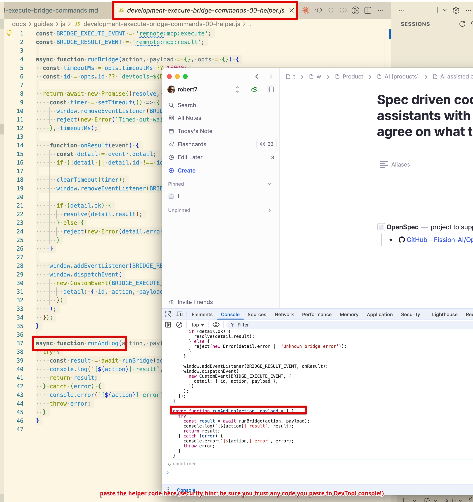
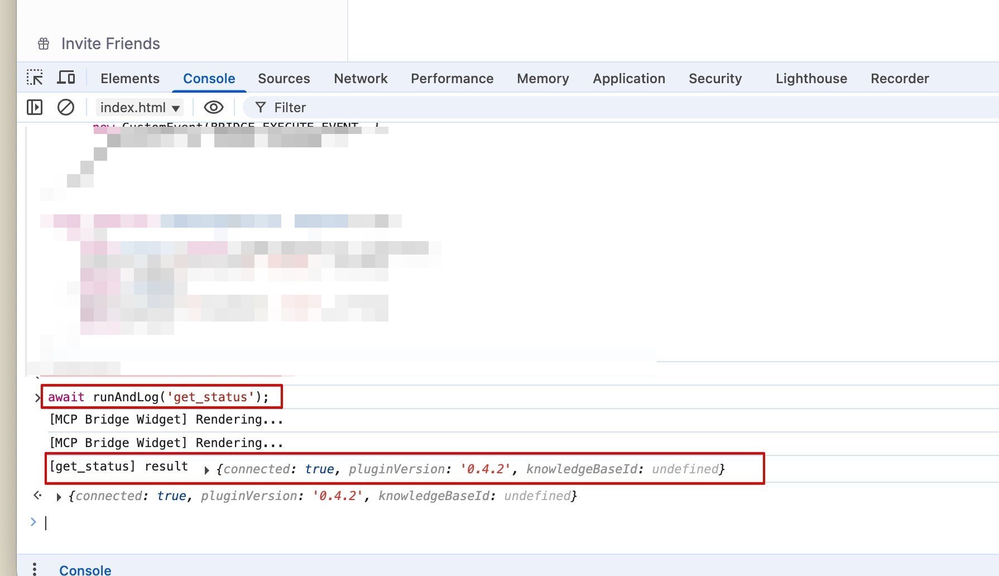
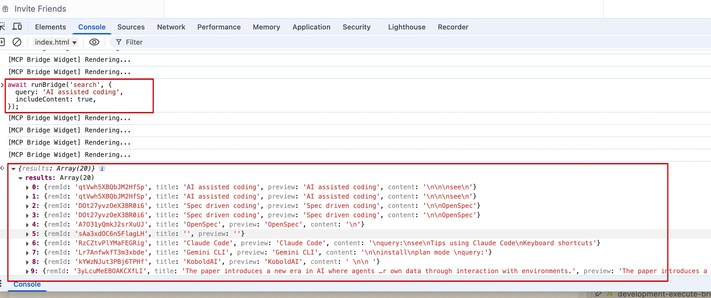

# Execute Bridge Commands from RemNote Developer Console (Screenshot Walkthrough)

This is a visual companion to:

- [Execute Bridge Commands from RemNote Developer Console](./development-execute-bridge-commands.md)

If you have not yet run the plugin locally, start with:

- [Run The Plugin Locally (Beginner Guide)](./development-run-plugin-locally.md)

## 1) Keep bridge panel visible and open helper source

Before running commands from DevTools:

- Make sure the **Automation Bridge (MCP, OpenClaw...)** panel is visible in RemNote.
- Open helper source file so you can copy it easily:
  - [`docs/guides/js/development-execute-bridge-commands-00-helper.js`](./js/development-execute-bridge-commands-00-helper.js)



## 2) Select the correct plugin iframe console context

In Chrome DevTools Console context picker:

- Choose `index.html (localhost:8080)` that maps to the visible plugin iframe.
- If multiple `localhost:8080` entries appear, test the other one if requests time out.



## 3) Paste helper into console

Paste and run the full helper code from the helper file once in that context.

Expected immediate output is typically `undefined` (this is fine).



## 4) Run a simple command first (`get_status`)

Run:

```js
await runAndLog('get_status');
```

Expected result: object with fields like `connected` and `pluginVersion`.



## 5) Run command with richer output (`search`)

Run:

```js
await runBridge('search', {
  query: 'AI assisted coding',
  includeContent: 'markdown',
});
```

Expected result: `{ results: [...] }` with `remId`, `title`, and optional `content` (markdown) or
`contentStructured` entries depending on `includeContent`.



## Troubleshooting (quick)

- Timeout after helper paste:
  - Usually wrong `localhost:8080` context selected.
  - Re-select the other `index.html (localhost:8080)` entry, paste helper again, retry.
- No events/responses:
  - Ensure bridge sidebar panel is open and visible; listener is registered by widget runtime.
- Helper functions undefined:
  - Paste helper again in the currently selected console context.

## Related guides

- [Execute Bridge Commands from RemNote Developer Console](./development-execute-bridge-commands.md)
- [Run The Plugin Locally (Beginner Guide)](./development-run-plugin-locally.md)
