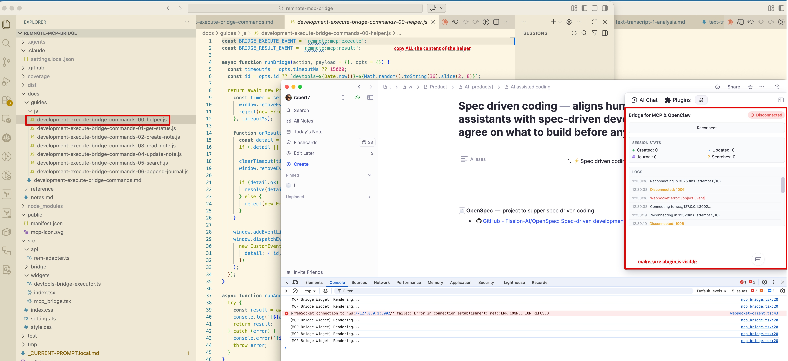
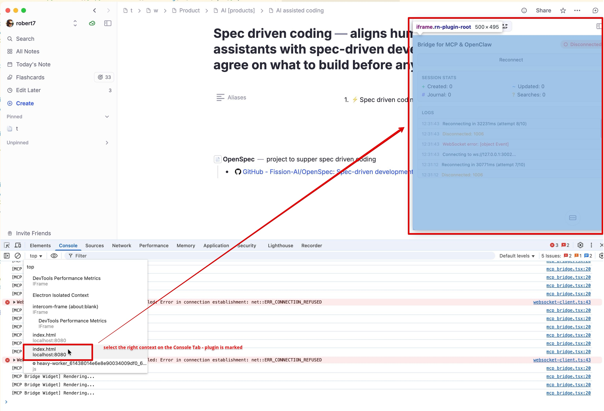
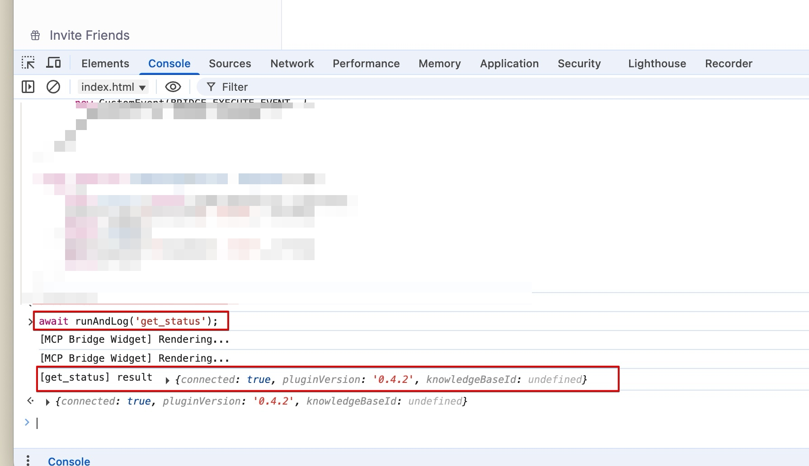
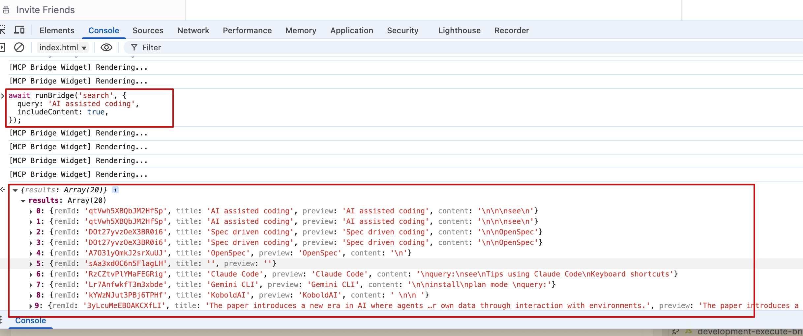

# Execute Bridge Commands from RemNote Developer Console (Screenshot Walkthrough)

This is a visual companion to:

- [Execute Bridge Commands from RemNote Developer Console](./development-execute-bridge-commands.md)

If you have not yet run the plugin locally, start with:

- [Run The Plugin Locally (Beginner Guide)](./development-run-plugin-locally.md)

## 1) Keep bridge panel visible

Before running commands from DevTools:

- Make sure the **Bridge for MCP & OpenClaw** panel is visible in RemNote.
- The helper functions `runBridge` and `runAndLog` are auto-exposed on `window` by the plugin — no paste step needed.



## 2) Use the default (top) console context

The helper functions are now exposed on the **top window** automatically — no iframe context switching needed.
Just open the Console tab and start typing commands.

> **Fallback:** If `window.top` is blocked by a cross-origin sandbox, the helpers fall back to the iframe `window`.
> In that case, select `index.html (localhost:8080)` in the DevTools context picker.



## 3) Run a simple command first (`get_status`)

Run:

```js
await runAndLog('get_status');
```

Expected result: object with fields like `connected` and `pluginVersion`.

> **Note:** The screenshot below may still show a manual paste step — this is no longer needed. Robert will update
> this screenshot in a future pass.



## 4) Run command with richer output (`search`)

Run:

```js
await runBridge('search', {
  query: 'AI assisted coding',
  includeContent: true,
});
```

Expected result: `{ results: [...] }` with `remId`, `title`, and optional `content` entries.



## Troubleshooting (quick)

- `runBridge is not a function`:
  - Bridge panel not open yet. Open the **Bridge for MCP & OpenClaw** sidebar panel first.
  - If `window.top` is cross-origin (rare), switch to the plugin iframe context (`index.html (localhost:8080)`).
- Timeout after running a command:
  - Ensure the bridge panel is visible and the plugin has initialized.
  - If cross-origin fallback is active, make sure you're in the correct iframe context.
- No events/responses:
  - Ensure bridge sidebar panel is open and visible; helper functions and event listener are registered by widget
    runtime.

## Related guides

- [Execute Bridge Commands from RemNote Developer Console](./development-execute-bridge-commands.md)
- [Run The Plugin Locally (Beginner Guide)](./development-run-plugin-locally.md)
