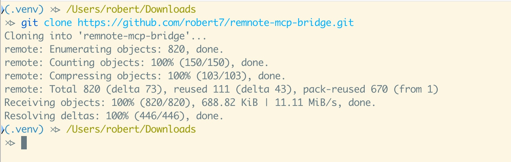
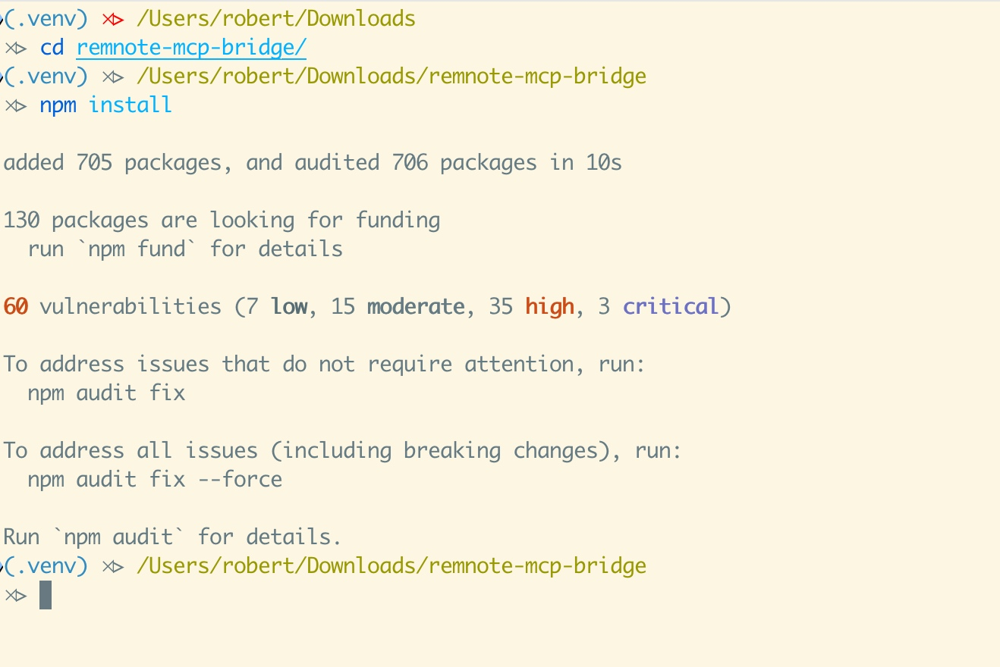
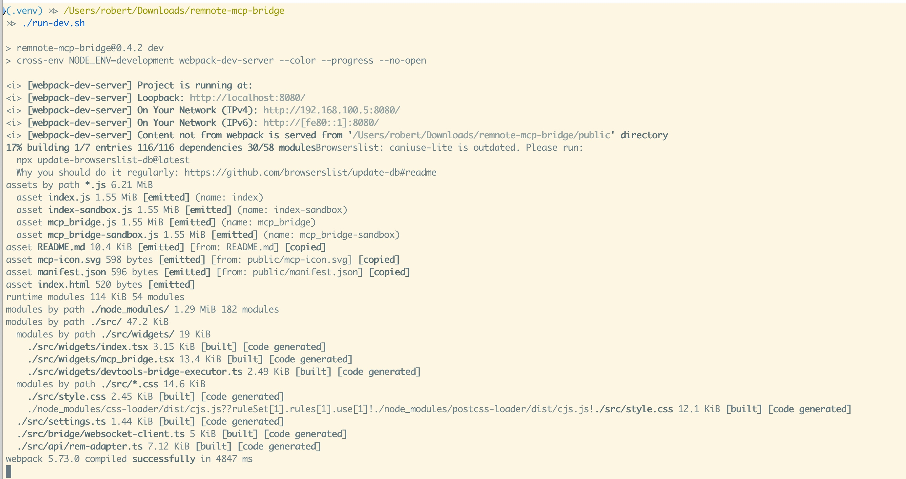
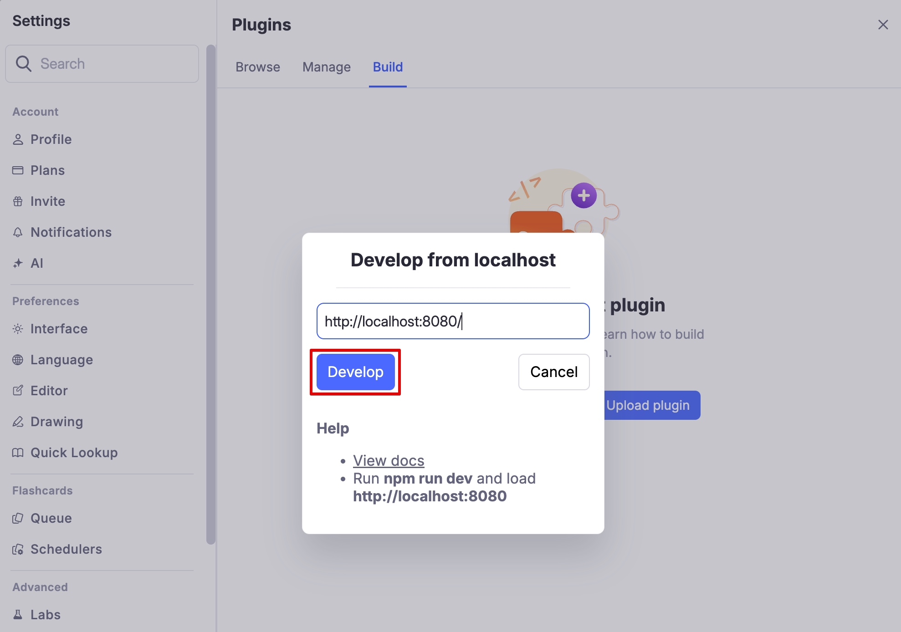

# Run The Plugin Locally (Beginner Guide)

This guide shows how to run `remnote-mcp-bridge` from source code and load it into RemNote for local development/testing.

## Prerequisites

- Node.js + npm installed
- RemNote desktop app or RemNote web app opened in browser
- Terminal access

If your shell cannot find Node.js in this repo environment, run:

```bash
source node-check.sh
```

> **Note**: this works if you installed Node.js via [nvm](https://github.com/nvm-sh/nvm),
> if this is not your setup, ensure Node.js is properly installed and available in your
> terminal and ignore the `source node-check.sh` step.

## 1. Clone the repository

```bash
git clone https://github.com/robert7/remnote-mcp-bridge.git
cd remnote-mcp-bridge
```



## 2. Install dependencies

```bash
npm install
```



## 3. Start the dev server

Use either command:

```bash
npm run dev
```

or

```bash
./run-dev.sh
```

Expected result: webpack dev server runs on `http://localhost:8080`.
Keep this terminal running while developing.



## 4. Open RemNote plugin Build screen

In RemNote:

1. Open `Settings`
2. Open `Plugins`
3. Switch to `Build`
4. Click `Develop from localhost`


## 5. Load plugin from localhost

In the dialog:

1. Enter `http://localhost:8080/`
2. Click `Develop`



## 6. Verify plugin is active

On the Plugins Build list, confirm:

- Plugin entry is visible (`RemNote Bridge for MCP & OpenClaw`)
- URL is `http://localhost:8080/`
- Status indicator is green / enabled


## 7. Open the plugin panel in sidebar

Use RemNote's right sidebar:

- Open the sidebar plugins panel
- Keep the sidebar pinned/open while testing
- Open **Bridge for MCP & OpenClaw**


## Common troubleshooting

- Nothing loads from localhost:
  - Confirm `npm run dev` is still running and shows `localhost:8080`.
- `Develop from localhost` fails:
  - Re-check URL exactly: `http://localhost:8080/`.
- Plugin loaded but behavior seems stale:
  - Keep dev server running; refresh RemNote after source changes if hot reload misses an update.
- Need to test console helpers from docs:
  - Use plugin iframe context in DevTools, and keep the bridge sidebar widget open so listeners are registered.

## Related guides

- [Execute Bridge Commands from RemNote Developer Console](./development-execute-bridge-commands.md)
- [Execute Bridge Commands from RemNote Developer Console (Screenshot Walkthrough)](./development-execute-bridge-commands-screenshots.md)
