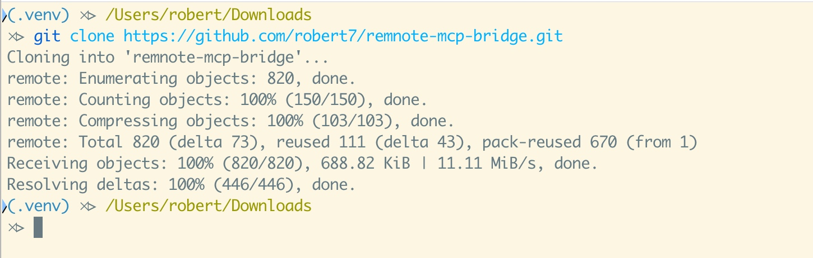
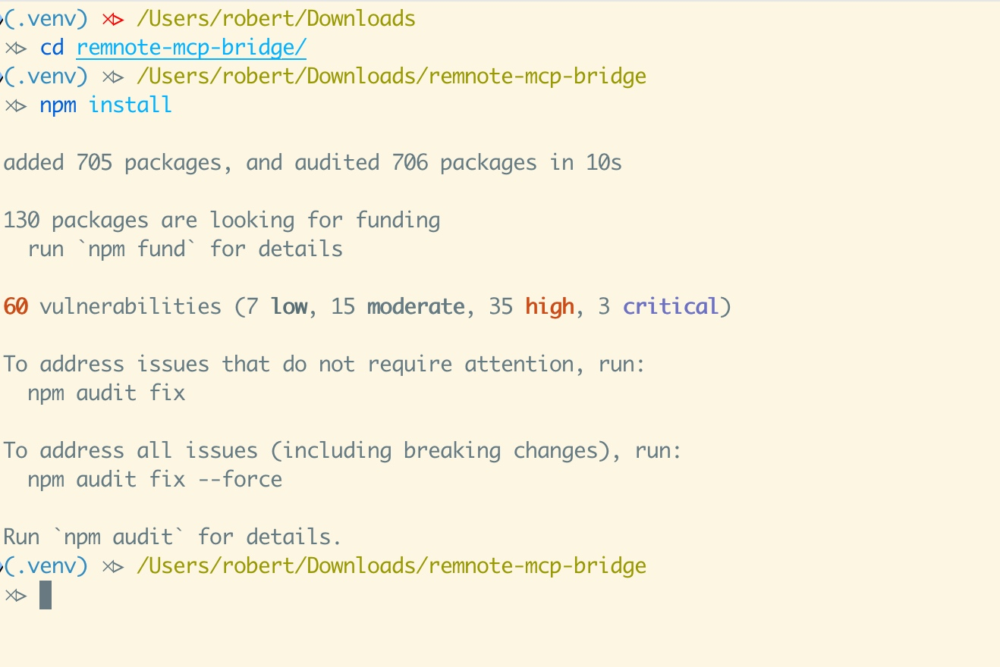
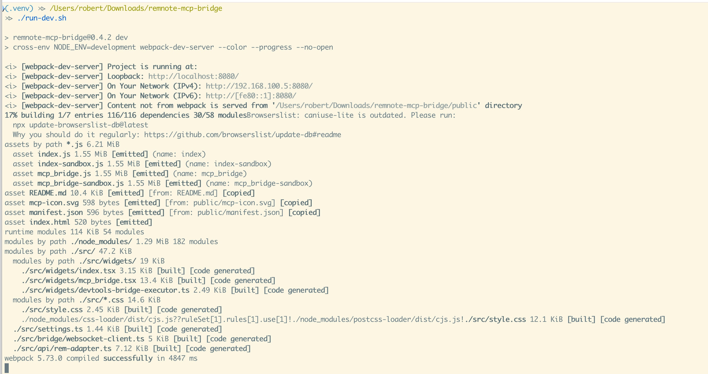
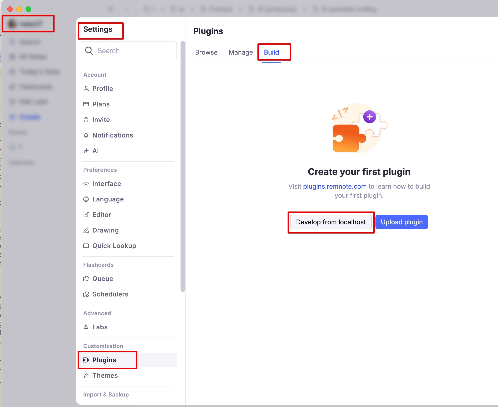
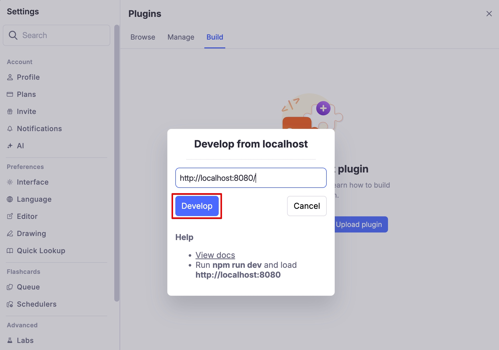
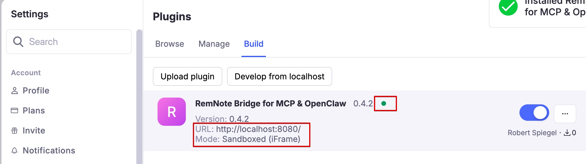
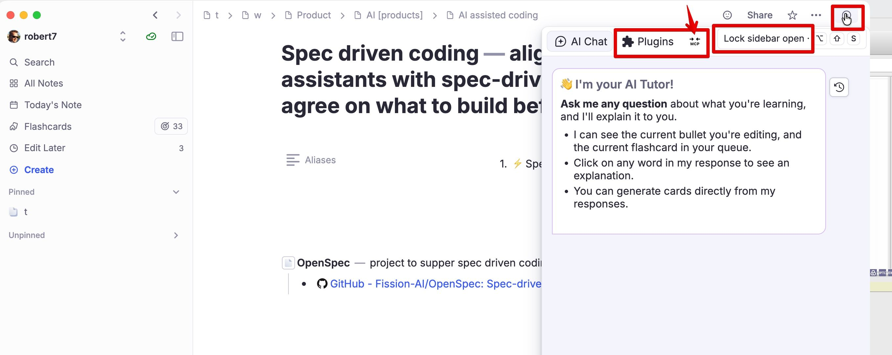

# Run The Plugin Locally (Beginner Guide)

This guide shows how to run `remnote-mcp-bridge` from source code and load it into RemNote for local development/testing.

> **Most users should use the marketplace install instead:** see
> [Install the Plugin via RemNote Marketplace (Beginner Guide)](./install-plugin-via-marketplace-beginner.md).

## Prerequisites

- Node.js 20.19.0+ + npm for local source development and code-quality commands
- RemNote desktop app or RemNote web app opened in browser
- Terminal access
- A plan to run the required companion package after plugin install:
  - [RemNote MCP Server](https://github.com/robert7/remnote-mcp-server), which also provides `remnote-cli`
- Version match your companion package to your bridge plugin (`0.x` semver can break on minor bumps); see [Bridge / Consumer Version Compatibility Guide](./bridge-consumer-version-compatibility.md)

If your shell cannot find a new enough Node.js in this repo environment, run:

```bash
source node-check.sh
```

> **Note**: this script prefers the version declared in this repo's `.nvmrc` (`20.19.0`) and also accepts newer
> installed Node versions when they satisfy that floor.
> It works best if you installed Node.js via [nvm](https://github.com/nvm-sh/nvm). If you
> use another setup, make sure a compatible Node.js version is already available in your terminal.

## 1. Clone the repository

```bash
git clone https://github.com/robert7/remnote-mcp-bridge.git
cd remnote-mcp-bridge
```



## 2. Install dependencies

```bash
npm install
```



## 3. Start the dev server

Use either command:

```bash
npm run dev
```

or

```bash
./run-dev.sh
```

Expected result: webpack dev server runs on `http://localhost:8080`.
Keep this terminal running while developing.



### Optional: production-style linked command

For a production-style local run without webpack dev server or hot reload:

```bash
./link-cli.sh
remnote-mcp-bridge
```

`./link-cli.sh` installs dependencies, runs tests, builds `dist/`, and links the local executable. After that,
`remnote-mcp-bridge` serves the built `dist/` bundle at `http://127.0.0.1:8080`, matching `./run-prod-build.sh`
server behavior. Re-run `./link-cli.sh` after source changes when you want a fresh production build.

## 4. Open RemNote plugin Build screen

In RemNote:

1. Open `Settings`
2. Open `Plugins`
3. Switch to `Build`
4. Click `Develop from localhost`



## 5. Load plugin from localhost

In the dialog:

1. Enter `http://localhost:8080/`
2. Click `Develop`



## 6. Verify plugin is active

On the Plugins Build list, confirm:

- Plugin entry is visible (`Automation Bridge (OpenClaw, CLI, MCP...)`)
- URL is `http://localhost:8080/`
- Status indicator is green / enabled



## 7. Open the plugin panel in sidebar

Use RemNote's right sidebar:

- Open the sidebar plugins panel
- Keep the sidebar pinned/open while testing
- Open **Automation Bridge (OpenClaw, CLI, MCP...)**

This panel is optional for connection setup. The bridge runtime starts automatically when the plugin activates, and the
panel is mainly for status, logs, and manual reconnect while testing.



## 8. Install and run the required server package

This step is **required**. Running the plugin locally is not enough by itself.

Install the server package:

- First check the [Bridge / Consumer Version Compatibility Guide](./bridge-consumer-version-compatibility.md) to pick a compatible `remnote-mcp-server` version for your installed bridge plugin version.
- Install guide: [RemNote MCP Server Installation](https://github.com/robert7/remnote-mcp-server/blob/main/docs/guides/installation.md)
- Demo: [RemNote MCP Server Demo](https://github.com/robert7/remnote-mcp-server/blob/main/docs/demo.md)
- Bundled CLI demo: [remnote-cli Demo](https://github.com/robert7/remnote-mcp-server/blob/main/docs/demo.md#remnote-cli)

Best order: start `remnote-mcp-server` first, then open RemNote. The bridge should connect automatically in the
background. Open the bridge sidebar panel if you want to verify status and inspect logs.

If RemNote was already open before the server was ready, the bridge should still connect automatically once
`remnote-mcp-server` starts. Click **Reconnect** in the panel only if you want an immediate retry.

## Common troubleshooting

- Nothing loads from localhost:
  - Confirm `npm run dev` is still running and shows `localhost:8080`.
- `Develop from localhost` fails:
  - Re-check URL exactly: `http://localhost:8080/`.
- Plugin loaded but behavior seems stale:
  - Keep dev server running; refresh RemNote after source changes if hot reload misses an update.
- Need to test console helpers from docs:
  - Use plugin iframe context in DevTools, and keep the bridge sidebar widget open so listeners are registered.
- Plugin panel shows disconnected:
  - The plugin is installed, but the companion package is not running yet. Start `remnote-mcp-server`.

## Related guides

- [Bridge / Consumer Version Compatibility Guide](./bridge-consumer-version-compatibility.md)
- [Install the Plugin via RemNote Marketplace (Beginner Guide)](./install-plugin-via-marketplace-beginner.md)
- [Execute Bridge Commands from RemNote Developer Console](./development-execute-bridge-commands.md)
- [Execute Bridge Commands from RemNote Developer Console (Screenshot Walkthrough)](./development-execute-bridge-commands-screenshots.md)
