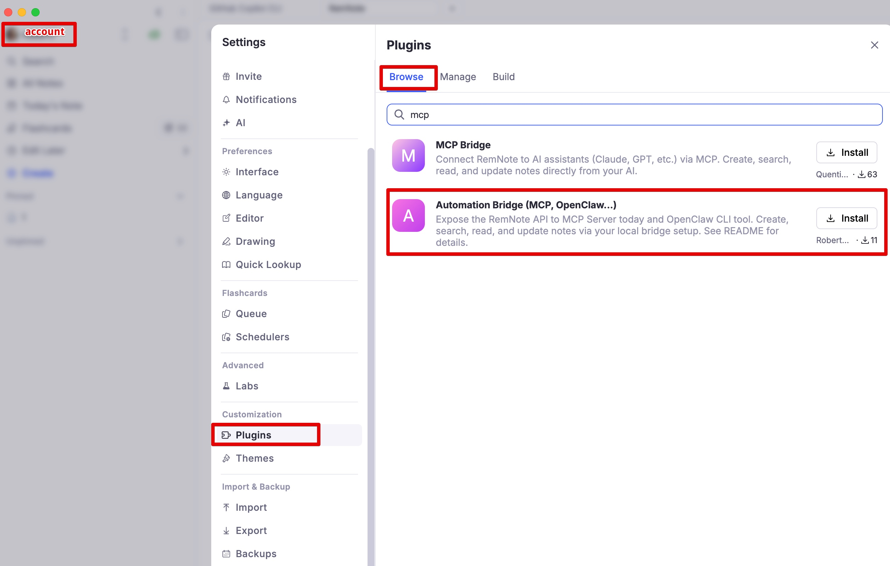
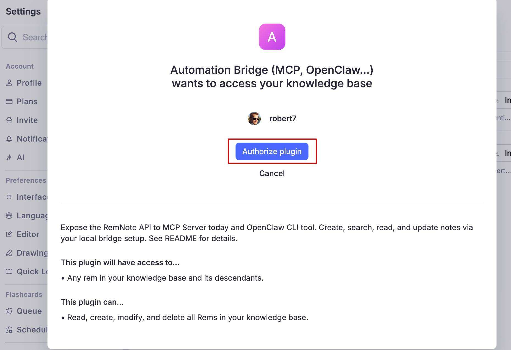
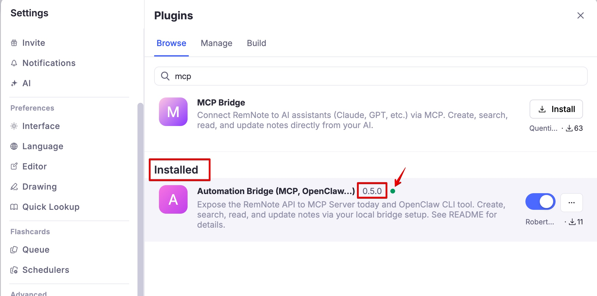
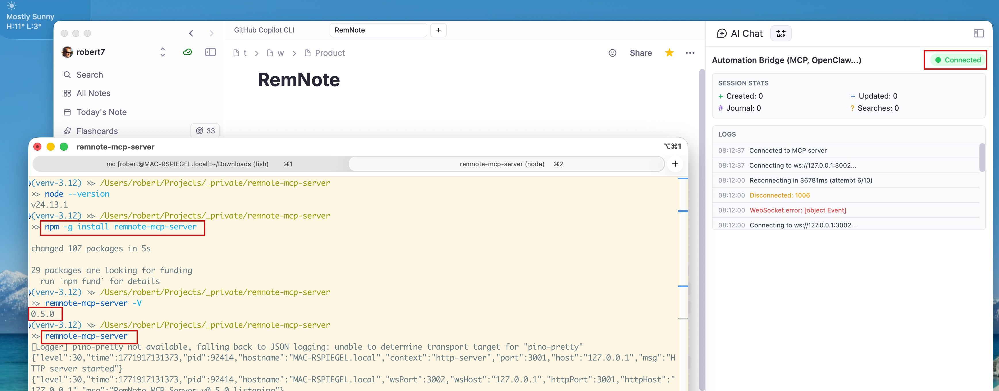

# Install the Plugin via RemNote Marketplace (Beginner Guide)

This guide shows the easiest way for most users to install `remnote-mcp-bridge` (the **Automation Bridge**) from the
RemNote plugin marketplace.

## Before you start (important)

Installing the plugin is only **one part** of the setup.

For the full solution to work, you also **must** install and run one companion component:

- **MCP path:** [RemNote MCP Server](https://github.com/robert7/remnote-mcp-server)
- **CLI path (OpenClaw and other agentic workflows):** [RemNote CLI](https://github.com/robert7/remnote-cli)

Without one of these companion apps, the plugin can install successfully but it will not connect and cannot do useful
work.

**Before installing or upgrading the companion app:** check the [Bridge / Consumer Version Compatibility Guide](./bridge-consumer-version-compatibility.md) so your server/CLI version matches your installed bridge plugin version.

## 1. Open RemNote Plugins and search the marketplace

In RemNote:

1. Open **Settings**
2. Open **Plugins**
3. Open the **Browse** tab
4. Search for `mcp`
5. Find **Automation Bridge (MCP, OpenClaw...)**
6. Click **Install**

## 2. Authorize the plugin

When RemNote asks for plugin permissions, click **Authorize plugin**.

## 3. Confirm it is installed and enabled

After installation, confirm:

- The plugin appears in the installed list
- The plugin is enabled (toggle on)
- A version is shown

## 4. Open the plugin panel in the right sidebar

Use the right sidebar in RemNote:

1. Open the right sidebar if it is collapsed
2. Click the **MCP** icon/button

## 5. Install and run the required companion component

This step is **required**. The plugin alone is not enough.

Choose one path:

- First check the [Bridge / Consumer Version Compatibility Guide](./bridge-consumer-version-compatibility.md) to pick a compatible server/CLI version for your installed bridge plugin version.

- **MCP Server path (for AI assistants via MCP):**
  - Install guide: [RemNote MCP Server Installation](https://github.com/robert7/remnote-mcp-server/blob/main/docs/guides/installation.md)
  - Demo: [RemNote MCP Server Demo](https://github.com/robert7/remnote-mcp-server/blob/main/docs/demo.md)
- **CLI path (for OpenClaw / automation workflows):**
  - Install guide: [RemNote CLI Installation](https://github.com/robert7/remnote-cli/blob/main/docs/guides/installation.md)
  - Demo: [RemNote CLI Demo](https://github.com/robert7/remnote-cli/blob/main/docs/demo.md)

Once your companion app is running, return to the plugin panel and confirm the status shows **Connected**.

## Which guide should you use?

- Use this guide if you want the simplest install path in normal day-to-day use.
- Use [Run The Plugin Locally (Beginner Guide)](./development-run-plugin-locally.md) if you are developing or testing
  the plugin from source code.
